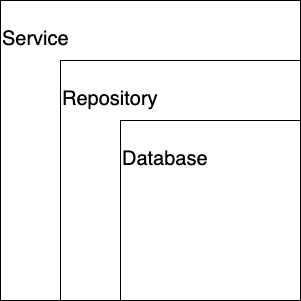

# GRPC-GO
This is an example of basic implementation of micro service oriented architecture using protocol buffers as an nformation exchange protocol.

The example represents the interaction between a client, who can order different dishes from a menu, and a restaurant, who has to prepare the orders. The client and the restaurant are separated and don't interact directly with each other, the interaction goes through the server how uses protocol buffers for the data transmition.

# Architecture
The architecture implemented for this example is a layered architecture based on the MVC architecture, with some modifications.
- the server implements the conection to the database, the repository layer to interact with the database and all services for each server.

- the client and restaurant simply implement their own services and the corresponding API interface to the final user.

